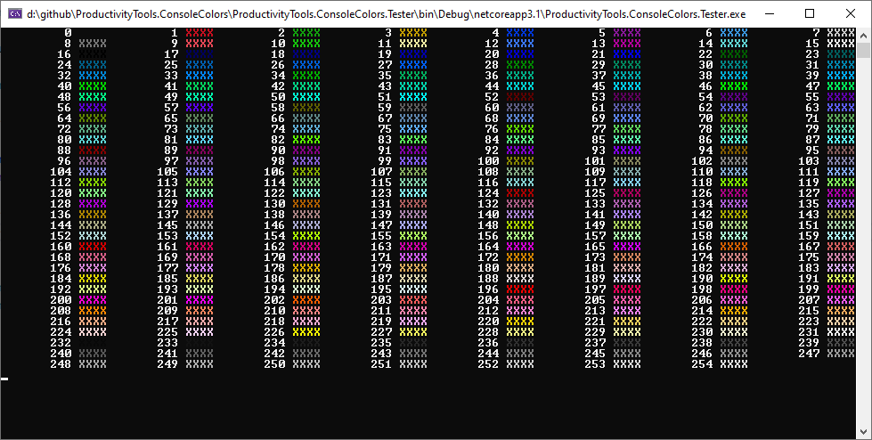

<!--Category:C#,PowerShell--> 
 <p align="right">
        <a href="https://www.nuget.org/packages/ProductivityTools.ConsoleColors/"></a>
        <a href="http://productivitytools.tech/consolecolors/"><a> 
        <a href="https://github.com/pwujczyk/ProductivityTools.ConsoleColors"></a>
</p>
<p align="center">
    <a href="http://productivitytools.tech/">
        
    </a>
</p>


# ConsoleColors

The library allows writing to console strings in different colors.
<!--more-->

To use it you need to create ```ConsoleColor``` object which will contain string and color in which you would like to print it. 
When you will add all text you need to invoke ```ConsoleColor.WriteInColor``` static method.

Below simple test of printing all possible colors to the cmd.

```c#
var text = new ColorString();
for (byte i = 0; i < 255; i++)
{
    text.Add(new ColorStringItem(i.ToString().PadLeft( 10,' '),15));
    text.Add(new ColorStringItem(" XXXX", i));
}

ConsoleColor.WriteInColor(text);
```


